# 📊 Grupo 1 - Diplomado Power BI PUCP

Evidencias del trabajo de Power BI - Diplomado en Data Visualization, PUCP

## 📝 Descripción General

Los reportes generados en **Power BI** representan el resultado del análisis de 
**deserción estudiantil**, transformando datos almacenados en SQL Server (Azure, 
schema G1) en visualizaciones claras orientadas a la toma de decisiones académicas. 
El modelo se construyó bajo un esquema de estrella, priorizando el rendimiento y la 
claridad en el análisis.

## ⚙️ Principales Características

- 🗂️ **Modelo de datos en estrella**: conexión a base de datos SQL Server en Azure, 
estructurando tablas de hechos y dimensiones para optimizar el análisis.
- 📊 **Medidas DAX personalizadas**: cálculo de la Tasa de Deserción y el Impacto 
Económico mediante funciones como LOOKUPVALUE, vinculando métricas con resultados 
académicos.
- 📅 **Tabla Calendario dinámica**: construida en DAX para permitir análisis temporal 
y comparaciones por periodo.
- 🔍 **Filtros dinámicos e interacción cruzada**: los usuarios pueden explorar los 
datos por facultad, periodo u otros criterios relevantes.
- ✅ **Verificación con SQL**: cada página del reporte fue validada con consultas 
SQL para garantizar la precisión de los datos mostrados.

## 🚀 Impacto

Este proyecto convierte los datos académicos de deserción en un soporte estratégico 
para la toma de decisiones institucionales. El análisis permite identificar patrones 
de riesgo y su impacto económico, contribuyendo a mejorar la retención estudiantil.

## 🛠️ Herramientas Utilizadas

- Power BI Desktop
- SQL Server (Azure)
- DAX (Data Analysis Expressions)
- Power BI Service

## 🧮 Medidas DAX — Inteligencia Analítica

### 🔴 Tasa de Deserción
Proporción de deserciones sobre el total de matrículas. Resultado global: 5.12%

```DAX
DIVIDE(COUNTROWS('G1 DESERCION'), COUNTROWS('G1 MATRICULA'), 0)
```

### 🔵 Tasa Deserción Año Anterior
Compara el mismo semestre del año anterior. Ej: 2025-2 vs 2024-2.

```DAX
CALCULATE([Tasa de Desercion], DATEADD(Calendario[Date], -12, MONTH))
```

### 🟢 Variación Tasa Deserción
Diferencia en puntos porcentuales respecto al mismo período del año anterior.

```DAX
[Tasa de Desercion] - [Tasa Desercion Año Anterior]
```

### 🟠 Tasa Deserción Semestre Anterior
Compara el semestre inmediatamente anterior. Ej: 2025-2 vs 2025-1.

```DAX
CALCULATE([Tasa de Desercion], DATEADD(Calendario[Date], -6, MONTH))
```

## 🔎 Hallazgos Principales

*Insights clave del análisis de deserción estudiantil PUCP*

### 🔴 8.61% — Pico máximo de deserción (2020-2)
Impacto COVID-19: la deserción se duplicó respecto al mismo semestre del año 
anterior (+106%)

### 🔵 5.12% — Tasa general de deserción (Global)
6,682 desertores sobre 130,500 matrículas registradas en el período 2019-2025

### 🟢 3.93% — Mínimo histórico reciente (2024-2)
La tendencia post-COVID muestra una mejora sostenida, con la tasa más baja 
registrada en 2024-2

### 🟡 +27% — Repunte reciente vs año anterior (2025-2)
2025-2 muestra una tasa del 5.00% vs 3.93% del 2024-2, señal de alerta para 
el siguiente período

## 📸 Evidencias del Proyecto

### 🗄️ Modelo Relacional — SQL Server

| Tablas | Registros | Llaves primarias | Relaciones |
|---|---|---|---|
| **14** | **242K+** | **14 PK** | **16 FK** |

**Tablas transaccionales**
- 🔵 **ALUMNO** — 30,000 filas
- 🔵 **MATRICULA** — 130,500 filas
- 🔵 **CURSOS_X_MATRICULA** — 75,063 filas
- 🔵 **DESERCION** — 6,682 filas

**Tablas maestras**
- 🔴 **FACULTAD** — 10 filas
- 🔴 **SEMESTRE_ACADEMICO** — 14 filas
- 🔴 **CAUSA_DESERCION** — 7 filas
- 🔴 **MATRICULA_ESTADO** — 5 filas

### 🗂️ Modelo de Datos

El modelo se construyó bajo un esquema de estrella, conectando las tablas de 
hechos (Matrícula, Deserción) con sus dimensiones correspondientes (Alumno, 
Facultad, Calendario, Escala de Pago, entre otras).

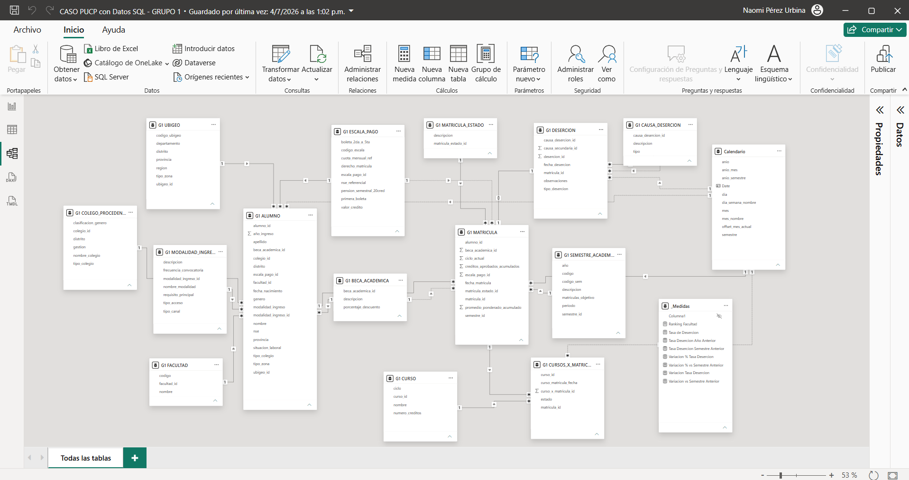

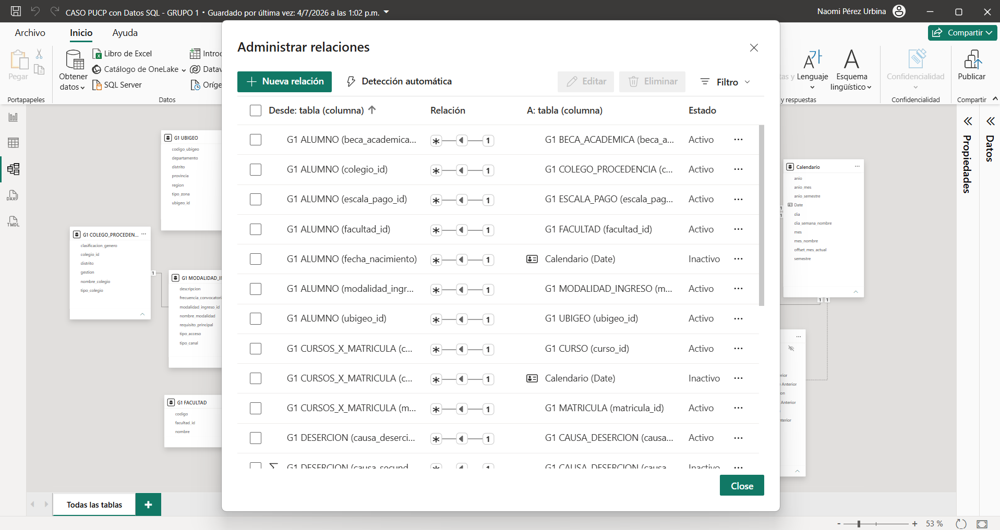

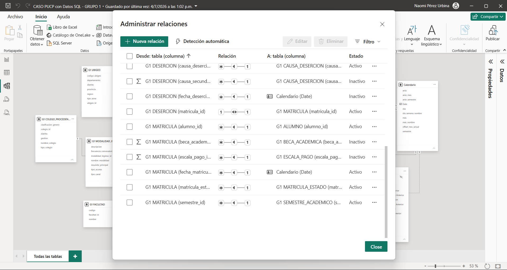

## 💼 Caso de Negocio

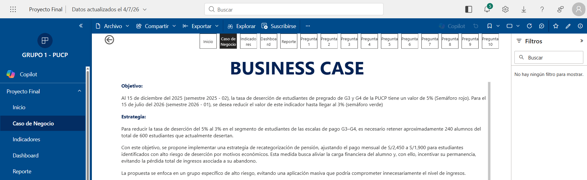

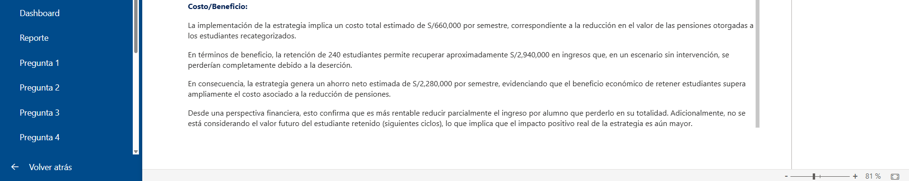

## 📐 Indicadores

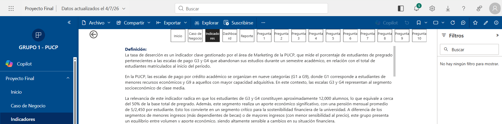

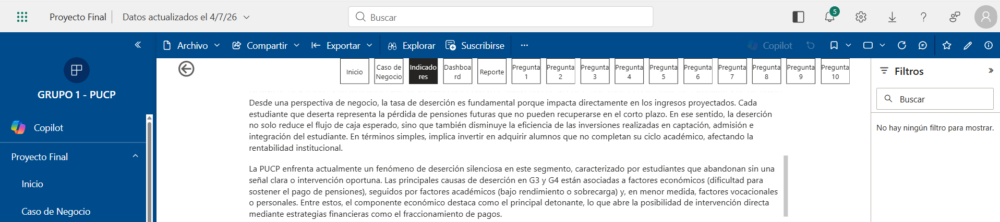

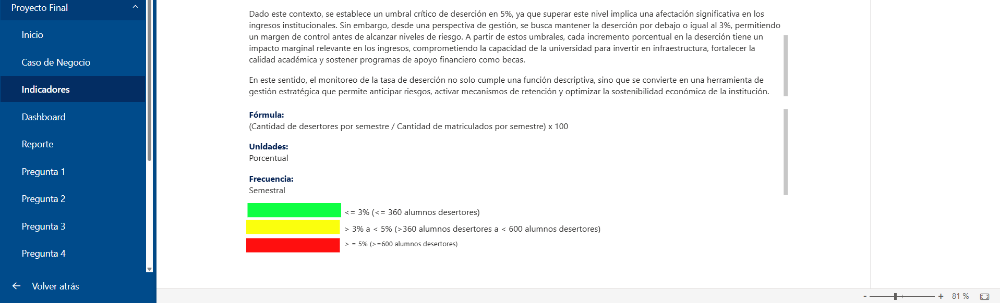

## 📊 Dashboard

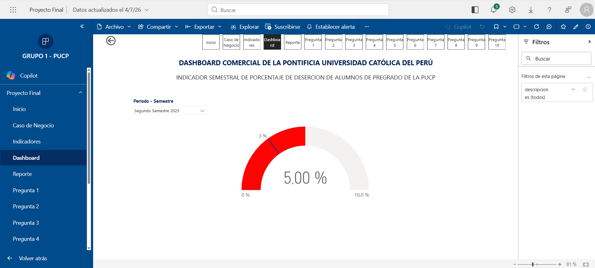

## 📄 Reporte

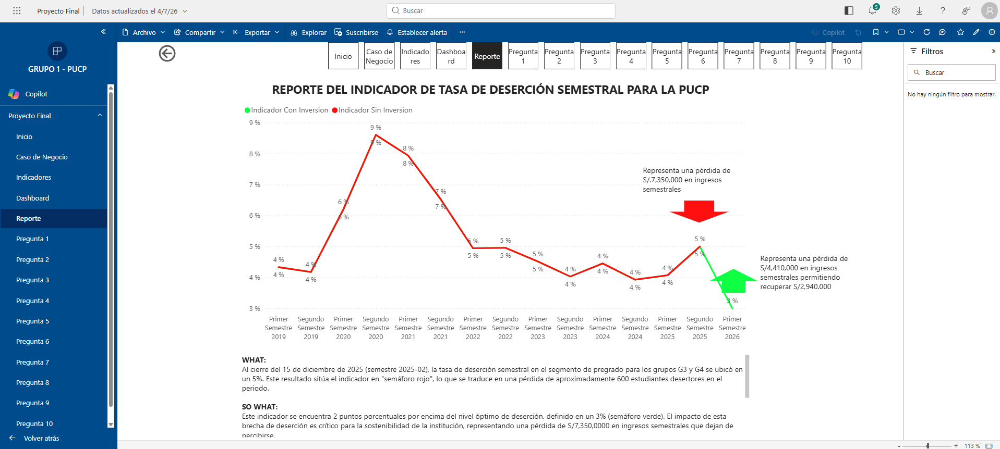


### Pregunta 1 - Tasa de Deserción por Género

**¿Qué género presenta el mayor indicador semestral de tasa de deserción de 
alumnos de pregrado en el semestre 2025-II?**

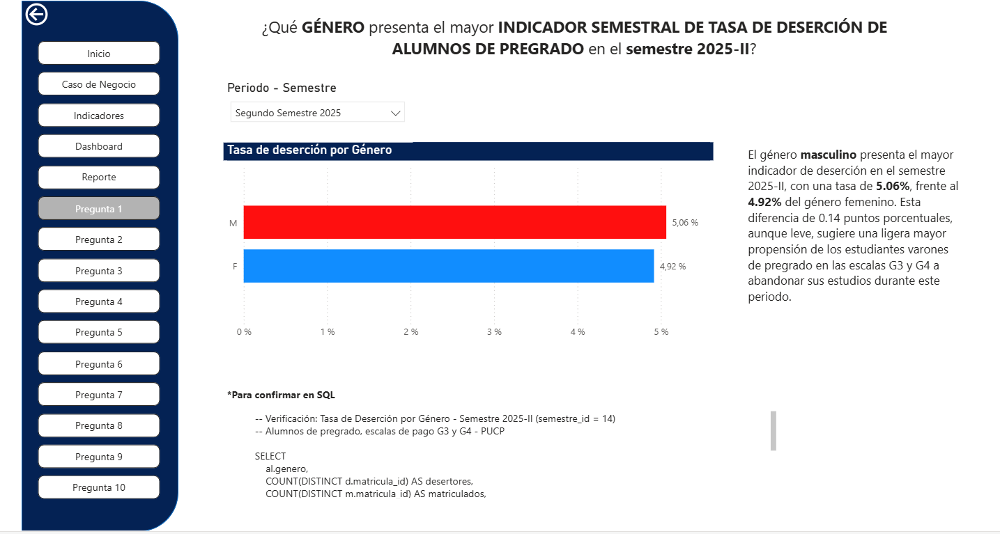

**Detalle**
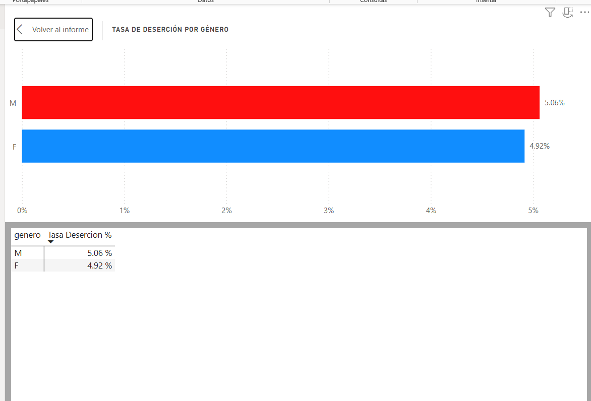

**Análisis**

El género masculino presenta el mayor indicador de deserción en el semestre 
2025-II, con una tasa de 5.06%, frente al 4.92% del género femenino. Esta 
diferencia de 0.14 puntos porcentuales, aunque leve, sugiere una ligera mayor 
propensión de los estudiantes varones de pregrado en las escalas G3 y G4 a 
abandonar sus estudios durante este periodo.

**Consulta SQL de verificación**
```sql
-- Verificación: Tasa de Deserción por Género - Semestre 2025-II (semestre_id = 14)
-- Alumnos de pregrado, escalas de pago G3 y G4 - PUCP

SELECT 
    al.genero,
    COUNT(DISTINCT d.matricula_id) AS desertores,
    COUNT(DISTINCT m.matricula_id) AS matriculados,
    CAST(COUNT(DISTINCT d.matricula_id) AS FLOAT) / COUNT(DISTINCT m.matricula_id) AS tasa_desercion
FROM G1.MATRICULA m
INNER JOIN G1.ALUMNO al 
    ON m.alumno_id = al.alumno_id
LEFT JOIN G1.DESERCION d 
    ON d.matricula_id = m.matricula_id
WHERE m.semestre_id = 14  -- Segundo Semestre 2025 (2025-2)
GROUP BY al.genero;
```

