# 📊 Grupo 1 - Diplomado Power BI PUCP

Evidencias del trabajo de Power BI - Diplomado en Data Visualization, PUCP

## 📝 Descripción General

Los reportes generados en **Power BI** representan el resultado del análisis de 
**deserción estudiantil**, transformando datos almacenados en SQL Server (Azure, 
schema G1) en visualizaciones claras orientadas a la toma de decisiones académicas. 
El modelo se construyó bajo un esquema de estrella, priorizando el rendimiento y la 
claridad en el análisis.

## ⚙️ Principales Características

- 🗂️ **Modelo de datos en estrella**: conexión a base de datos SQL Server en Azure, 
estructurando tablas de hechos y dimensiones para optimizar el análisis.
- 🗄️ **Base de datos documentada**: script SQL completo de creación con 14 
tablas, 14 Primary Keys y 16 Foreign Keys, replicable en cualquier instancia 
de SQL Server.
- 📊 **Medidas DAX personalizadas**: cálculo de la Tasa de Deserción y el Impacto 
Económico mediante funciones como LOOKUPVALUE, vinculando métricas con resultados 
académicos.
- 📅 **Tabla Calendario dinámica**: construida en DAX para permitir análisis temporal 
y comparaciones por periodo.
- 🔍 **Filtros dinámicos e interacción cruzada**: los usuarios pueden explorar los 
datos por facultad, periodo u otros criterios relevantes.
- ✅ **Verificación con SQL**: cada página del reporte fue validada con consultas 
SQL para garantizar la precisión de los datos mostrados.

## 🚀 Impacto

Este proyecto convierte los datos académicos de deserción en un soporte estratégico 
para la toma de decisiones institucionales. El análisis permite identificar patrones 
de riesgo y su impacto económico, contribuyendo a mejorar la retención estudiantil.

## 🛠️ Herramientas Utilizadas

- Power BI Desktop
- SQL Server (Azure)
- DAX (Data Analysis Expressions)
- Power BI Service

## 🧮 Medidas DAX — Inteligencia Analítica

### 🔴 Tasa de Deserción
Proporción de deserciones sobre el total de matrículas. Resultado global: 5.12%

```DAX
DIVIDE(COUNTROWS('G1 DESERCION'), COUNTROWS('G1 MATRICULA'), 0)
```

### 🔵 Tasa Deserción Año Anterior
Compara el mismo semestre del año anterior. Ej: 2025-2 vs 2024-2.

```DAX
CALCULATE([Tasa de Desercion], DATEADD(Calendario[Date], -12, MONTH))
```

### 🟢 Variación Tasa Deserción
Diferencia en puntos porcentuales respecto al mismo período del año anterior.

```DAX
[Tasa de Desercion] - [Tasa Desercion Año Anterior]
```

### 🟠 Tasa Deserción Semestre Anterior
Compara el semestre inmediatamente anterior. Ej: 2025-2 vs 2025-1.

```DAX
CALCULATE([Tasa de Desercion], DATEADD(Calendario[Date], -6, MONTH))
```

## 🔎 Hallazgos Principales

*Insights clave del análisis de deserción estudiantil PUCP*

### 🔴 8.61% — Pico máximo de deserción (2020-2)
Impacto COVID-19: la deserción se duplicó respecto al mismo semestre del año 
anterior (+106%)

### 🔵 5.12% — Tasa general de deserción (Global)
6,682 desertores sobre 130,500 matrículas registradas en el período 2019-2025

### 🟢 3.93% — Mínimo histórico reciente (2024-2)
La tendencia post-COVID muestra una mejora sostenida, con la tasa más baja 
registrada en 2024-2

### 🟡 +27% — Repunte reciente vs año anterior (2025-2)
2025-2 muestra una tasa del 5.00% vs 3.93% del 2024-2, señal de alerta para 
el siguiente período

## 📸 Evidencias del Proyecto

### 🗄️ Modelo Relacional — SQL Server

| Tablas | Registros | Llaves primarias | Relaciones |
|---|---|---|---|
| **14** | **242K+** | **14 PK** | **16 FK** |

**Tablas transaccionales**
- 🔵 **ALUMNO** — 30,000 filas
- 🔵 **MATRICULA** — 130,500 filas
- 🔵 **CURSOS_X_MATRICULA** — 75,063 filas
- 🔵 **DESERCION** — 6,682 filas

**Tablas maestras**
- 🔴 **FACULTAD** — 10 filas
- 🔴 **SEMESTRE_ACADEMICO** — 14 filas
- 🔴 **CAUSA_DESERCION** — 7 filas
- 🔴 **MATRICULA_ESTADO** — 5 filas

### 💾 Script SQL - Creación de Base de Datos

El siguiente script contiene la creación completa de las 14 tablas del 
esquema G1, sus 14 llaves primarias (PK) y las 16 relaciones (FK) que 
conforman el modelo relacional en SQL Server (Azure).

📄 [Ver script completo: script-creacion-bd.sql](script-creacion-bd.sql)

**Resumen del script:**
- **Paso 1:** Creación de 10 tablas de dimensión y 4 tablas transaccionales
- **Paso 2:** Definición de 14 Primary Keys
- **Paso 3:** Definición de 16 Foreign Keys, conectando ALUMNO → 6 dimensiones, 
MATRICULA → ALUMNO y 4 dimensiones, CURSOS_X_MATRICULA → MATRICULA y CURSO, y 
DESERCION → MATRICULA y CAUSA_DESERCION (causa principal y secundaria)
- **Paso 4:** Consultas de verificación para confirmar la correcta creación 
de tablas y relaciones

### 🗂️ Modelo de Datos

El modelo se construyó bajo un esquema de estrella, conectando las tablas de 
hechos (Matrícula, Deserción) con sus dimensiones correspondientes (Alumno, 
Facultad, Calendario, Escala de Pago, entre otras).


## 💼 Caso de Negocio


## 📐 Indicadores


## 📊 Dashboard


## 📄 Reporte


### Pregunta 1 - Tasa de Deserción por Género

**¿Qué género presenta el mayor indicador semestral de tasa de deserción de 
alumnos de pregrado en el semestre 2025-II?**


**Explorar detalle**
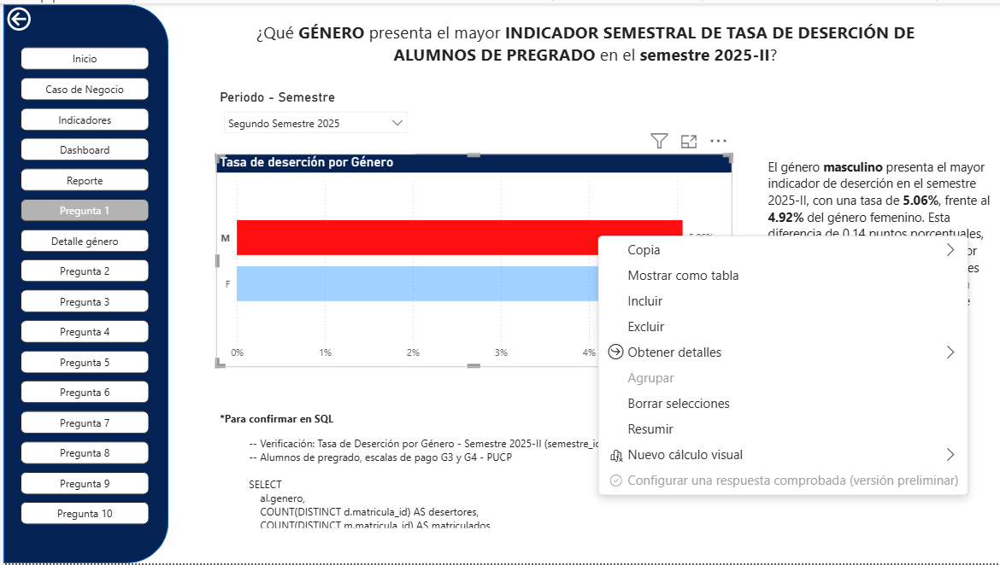


**Análisis**

El género masculino presenta el mayor indicador de deserción en el semestre 
2025-II, con una tasa de 5.06%, frente al 4.92% del género femenino. Esta 
diferencia de 0.14 puntos porcentuales, aunque leve, sugiere una ligera mayor 
propensión de los estudiantes varones de pregrado en las escalas G3 y G4 a 
abandonar sus estudios durante este periodo.

**Consulta SQL de verificación**
```sql
-- Verificación: Tasa de Deserción por Género - Semestre 2025-II (semestre_id = 14)
-- Alumnos de pregrado, escalas de pago G3 y G4 - PUCP

SELECT 
    al.genero,
    COUNT(DISTINCT d.matricula_id) AS desertores,
    COUNT(DISTINCT m.matricula_id) AS matriculados,
    CAST(COUNT(DISTINCT d.matricula_id) AS FLOAT) / COUNT(DISTINCT m.matricula_id) AS tasa_desercion
FROM G1.MATRICULA m
INNER JOIN G1.ALUMNO al 
    ON m.alumno_id = al.alumno_id
LEFT JOIN G1.DESERCION d 
    ON d.matricula_id = m.matricula_id
WHERE m.semestre_id = 14  -- Segundo Semestre 2025 (2025-2)
GROUP BY al.genero;
```

### Pregunta 2 - Tasa de Deserción por Distrito

**¿Qué distrito presenta el mayor indicador semestral de tasa de deserción de 
alumnos de pregrado en el semestre 2025-II?**

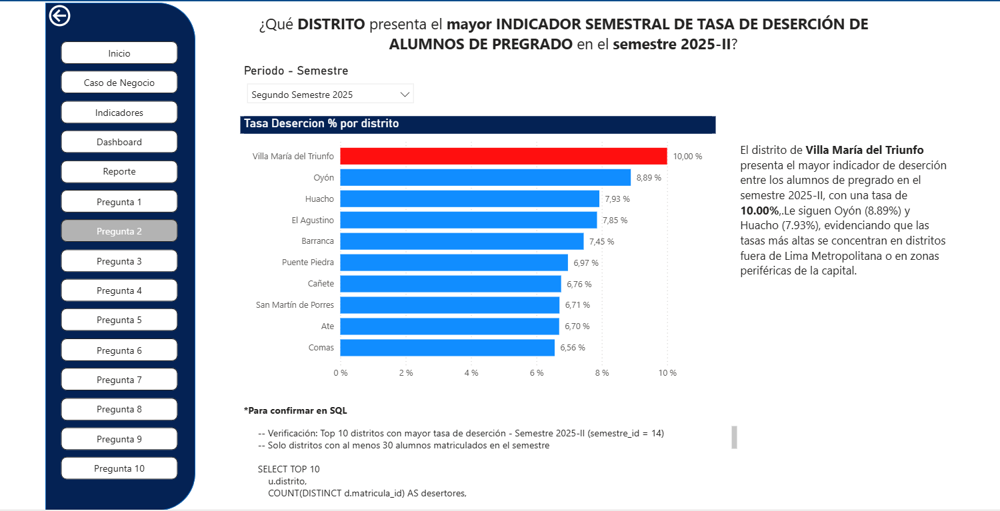

**Explorar detalle**
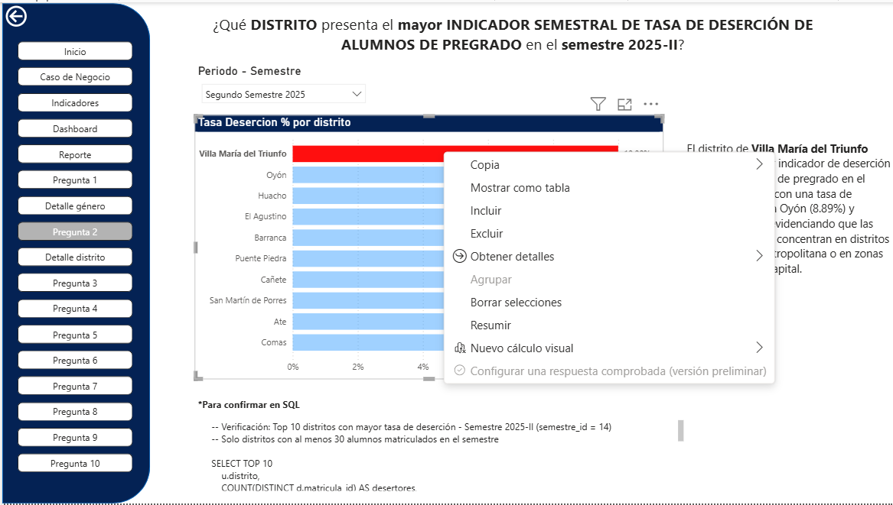

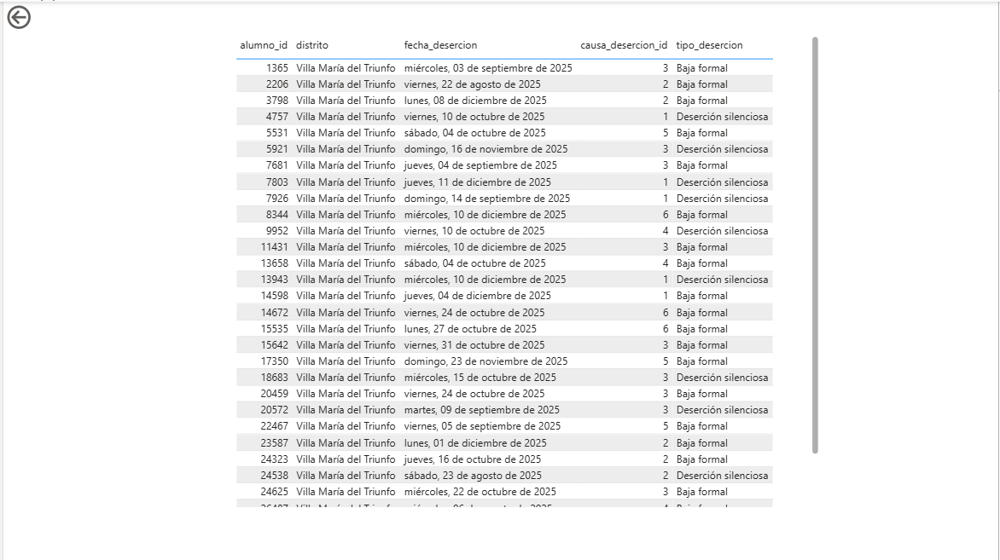

**Análisis**

El distrito de Villa María del Triunfo presenta el mayor indicador de deserción 
entre los alumnos de pregrado en el semestre 2025-II, con una tasa de 10.00%. 
Le siguen Oyón (8.89%) y Huacho (7.93%), evidenciando que las tasas más altas 
se concentran en distritos fuera de Lima Metropolitana o en zonas periféricas 
de la capital.

**Consulta SQL de verificación**
```sql
-- Verificación: Top 10 distritos con mayor tasa de deserción - Semestre 2025-II (semestre_id = 14)
-- Solo distritos con al menos 30 alumnos matriculados en el semestre

SELECT TOP 10
    u.distrito,
    COUNT(DISTINCT d.matricula_id) AS desertores,
    COUNT(DISTINCT m.matricula_id) AS matriculados,
    CAST(COUNT(DISTINCT d.matricula_id) AS FLOAT) / COUNT(DISTINCT m.matricula_id) AS tasa_desercion
FROM G1.MATRICULA m
INNER JOIN G1.ALUMNO al 
    ON m.alumno_id = al.alumno_id
INNER JOIN G1.UBIGEO u 
    ON al.ubigeo_id = u.ubigeo_id
LEFT JOIN G1.DESERCION d 
    ON d.matricula_id = m.matricula_id
WHERE m.semestre_id = 14  -- Segundo Semestre 2025 (2025-2)
GROUP BY u.distrito
HAVING COUNT(DISTINCT m.matricula_id) >= 30
ORDER BY tasa_desercion DESC;
```

### Pregunta 3 - Tasa de Deserción por Año de Ingreso

**¿Qué año de ingreso registra el mayor indicador semestral de tasa de 
deserción de alumnos de pregrado en el semestre 2025-II?**

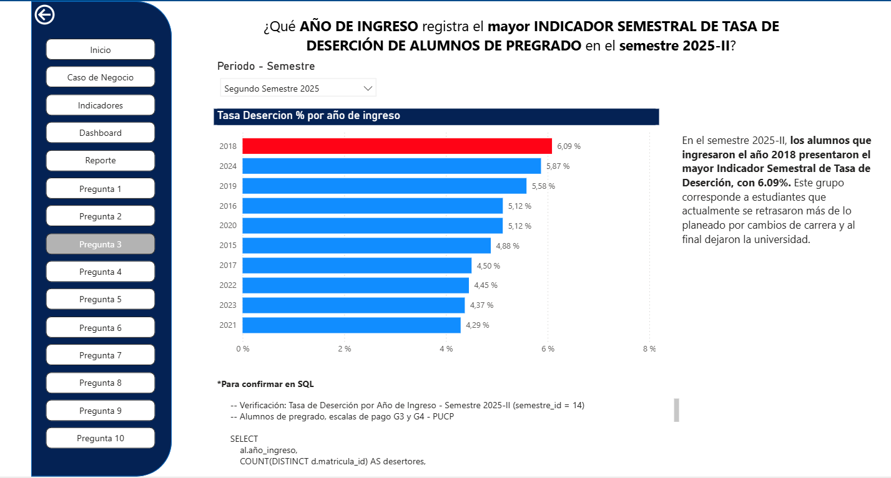

**Explorar detalle**
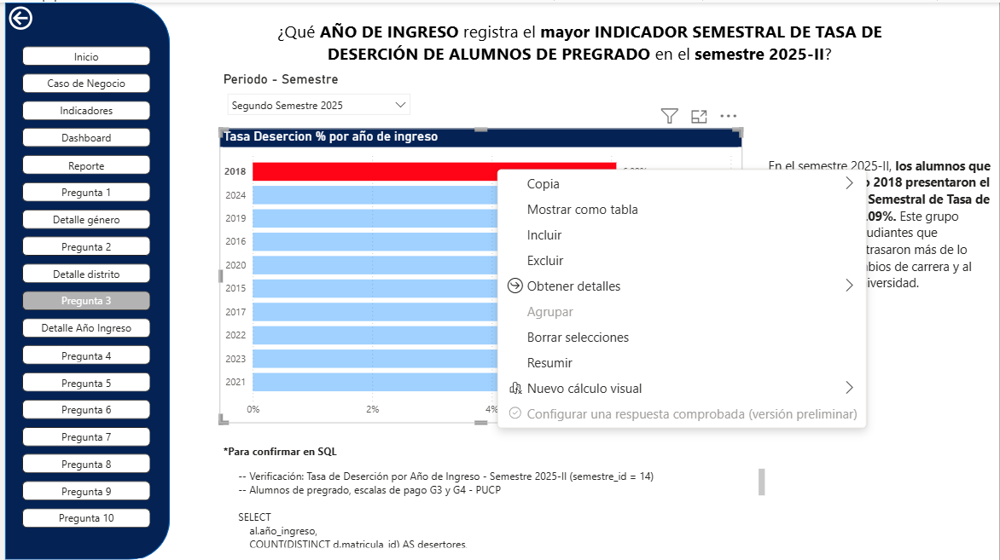

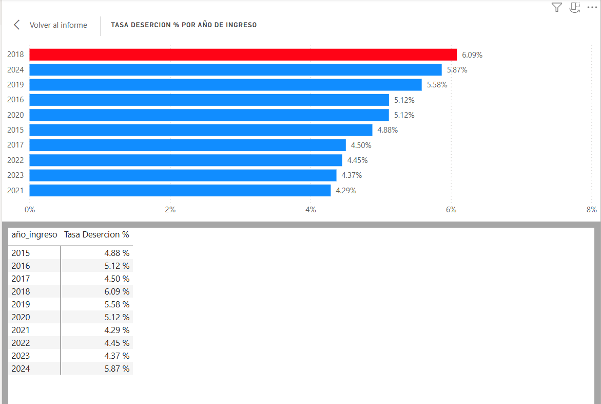

**Análisis**

En el semestre 2025-II, los alumnos que ingresaron el año 2018 presentaron el 
mayor Indicador Semestral de Tasa de Deserción, con 6.09%. Este grupo 
corresponde a estudiantes que actualmente se retrasaron más de lo planeado por 
cambios de carrera y al final dejaron la universidad.

**Consulta SQL de verificación**
```sql
-- Verificación: Tasa de Deserción por Año de Ingreso - Semestre 2025-II (semestre_id = 14)
-- Alumnos de pregrado, escalas de pago G3 y G4 - PUCP

SELECT 
    al.año_ingreso,
    COUNT(DISTINCT d.matricula_id) AS desertores,
    COUNT(DISTINCT m.matricula_id) AS matriculados,
    CAST(COUNT(DISTINCT d.matricula_id) AS FLOAT) / COUNT(DISTINCT m.matricula_id) AS tasa_desercion
FROM G1.MATRICULA m
INNER JOIN G1.ALUMNO al 
    ON m.alumno_id = al.alumno_id
LEFT JOIN G1.DESERCION d 
    ON d.matricula_id = m.matricula_id
WHERE m.semestre_id = 14  -- Segundo Semestre 2025 (2025-2)
GROUP BY al.año_ingreso
ORDER BY tasa_desercion DESC;
```

### Pregunta 4 - Tasa de Deserción por Facultad

**¿Cuál es la facultad con mayor indicador semestral de tasa de deserción de 
alumnos de pregrado en el semestre 2025-II?**

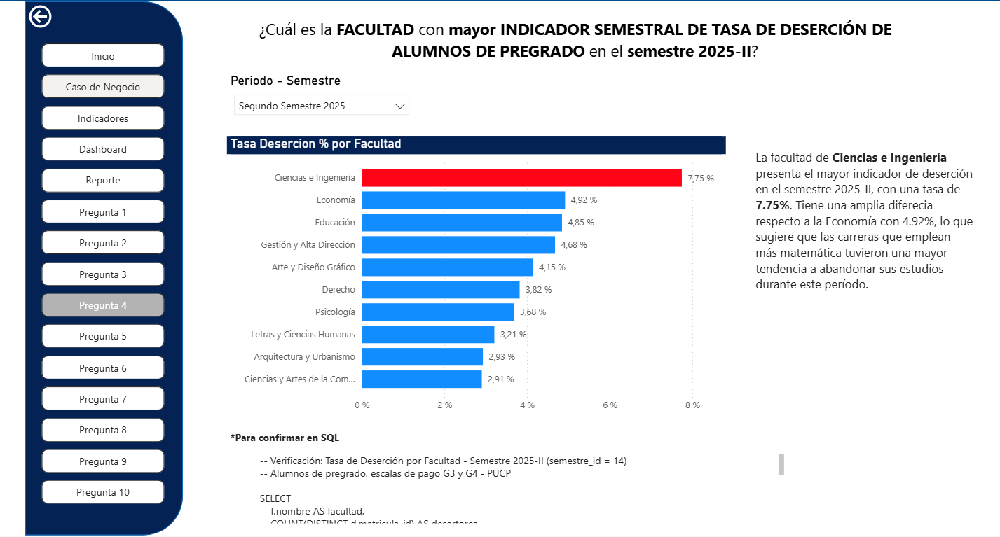

**Explorar detalle**
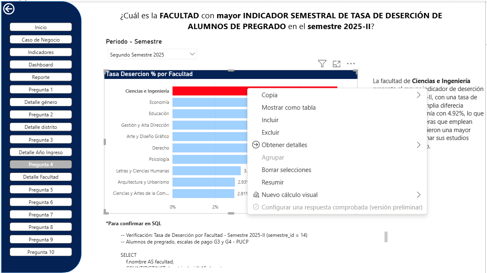

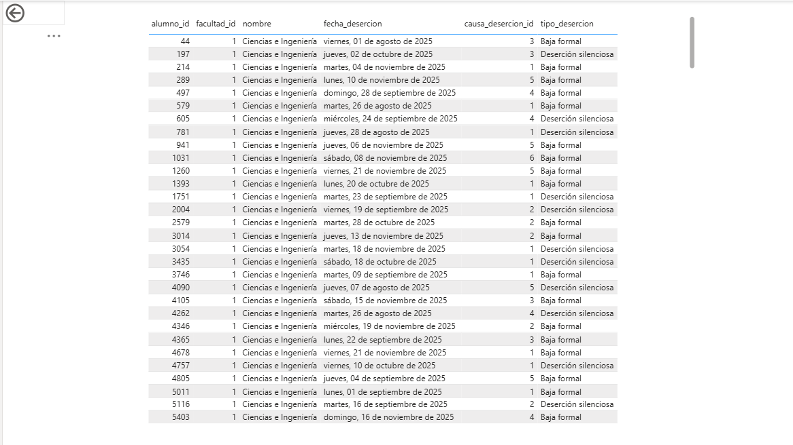

**Análisis**

La facultad de Ciencias e Ingeniería presenta el mayor indicador de deserción 
en el semestre 2025-II, con una tasa de 7.75%. Tiene una amplia diferencia 
respecto a Economía con 4.92%, lo que sugiere que las carreras que emplean más 
matemática tuvieron una mayor tendencia a abandonar sus estudios durante este 
período.

**Consulta SQL de verificación**
```sql
-- Verificación: Tasa de Deserción por Facultad - Semestre 2025-II (semestre_id = 14)
-- Alumnos de pregrado, escalas de pago G3 y G4 - PUCP

SELECT 
    f.nombre AS facultad,
    COUNT(DISTINCT d.matricula_id) AS desertores,
    COUNT(DISTINCT m.matricula_id) AS matriculados,
    CAST(COUNT(DISTINCT d.matricula_id) AS FLOAT) / COUNT(DISTINCT m.matricula_id) AS tasa_desercion
FROM G1.MATRICULA m
INNER JOIN G1.ALUMNO al 
    ON m.alumno_id = al.alumno_id
INNER JOIN G1.FACULTAD f 
    ON al.facultad_id = f.facultad_id
LEFT JOIN G1.DESERCION d 
    ON d.matricula_id = m.matricula_id
WHERE m.semestre_id = 14  -- Segundo Semestre 2025 (2025-2)
GROUP BY f.nombre
ORDER BY tasa_desercion DESC;
```

### Pregunta 5 - Causa de Deserción con Mayor Tasa

**¿Cuál es la causa de deserción con mayor indicador semestral de tasa de 
deserción de alumnos de pregrado en el semestre 2025-II?**

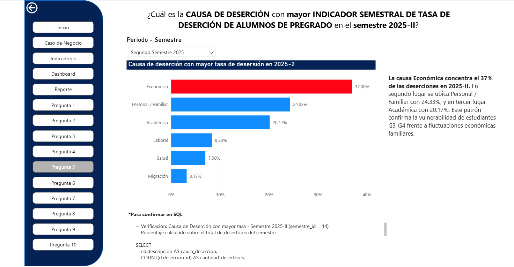

**Explorar detalle**
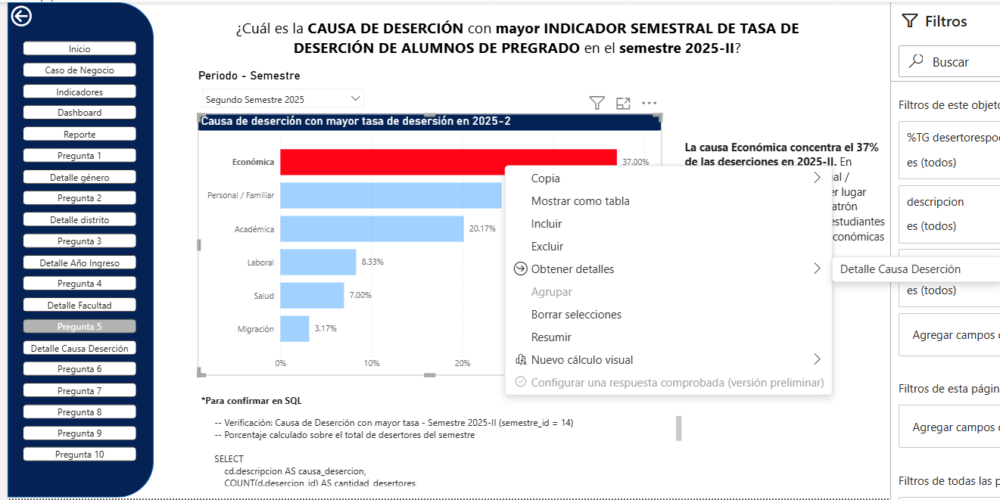

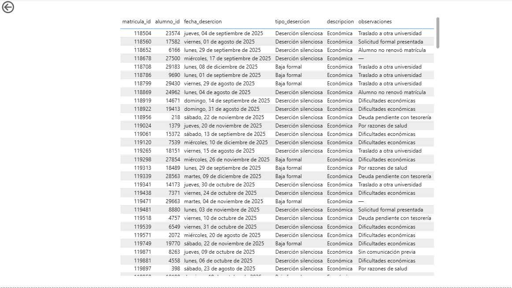

**Análisis**

La causa Económica concentra el 37% de las deserciones en 2025-II. En segundo 
lugar se ubica Personal/Familiar con 24.33%, y en tercer lugar Académica con 
20.17%. Este patrón confirma la vulnerabilidad de estudiantes G3-G4 frente a 
fluctuaciones económicas familiares.

**Consulta SQL de verificación**
```sql
-- Verificación: Causa de Deserción con mayor tasa - Semestre 2025-II (semestre_id = 14)
-- Porcentaje calculado sobre el total de desertores del semestre

SELECT 
    cd.descripcion AS causa_desercion,
    COUNT(d.desercion_id) AS cantidad_desertores,
    CAST(COUNT(d.desercion_id) AS FLOAT) / 
        SUM(COUNT(d.desercion_id)) OVER () AS porcentaje
FROM G1.DESERCION d
INNER JOIN G1.MATRICULA m 
    ON d.matricula_id = m.matricula_id
INNER JOIN G1.CAUSA_DESERCION cd 
    ON d.causa_desercion_id = cd.causa_desercion_id
WHERE m.semestre_id = 14  -- Segundo Semestre 2025 (2025-2)
GROUP BY cd.descripcion
ORDER BY porcentaje DESC;
```

### Pregunta 6 - Tasa de Deserción por Tipo de Colegio de Procedencia

**¿Cuál es el tipo de colegio de procedencia con mayor indicador semestral de 
tasa de deserción de alumnos de pregrado en el semestre 2025-II?**

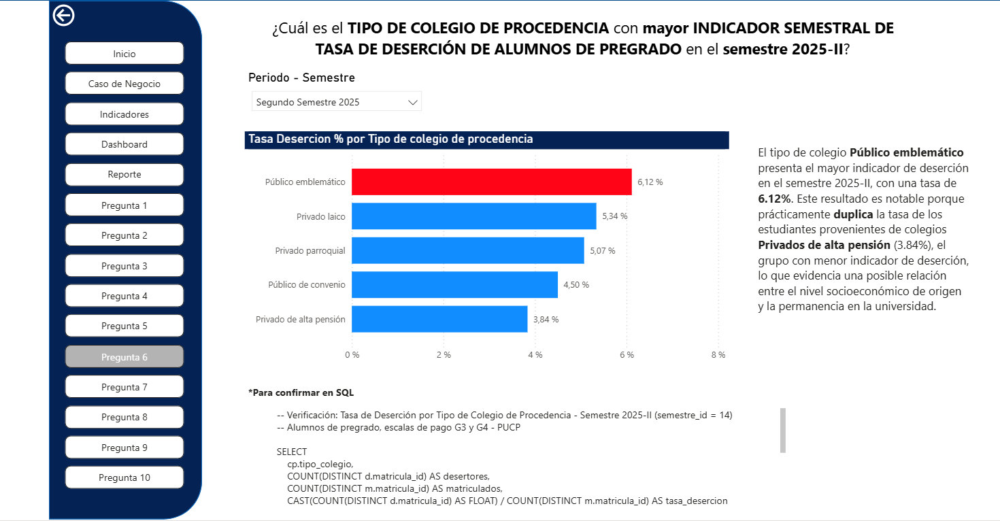

**Explorar detalle**
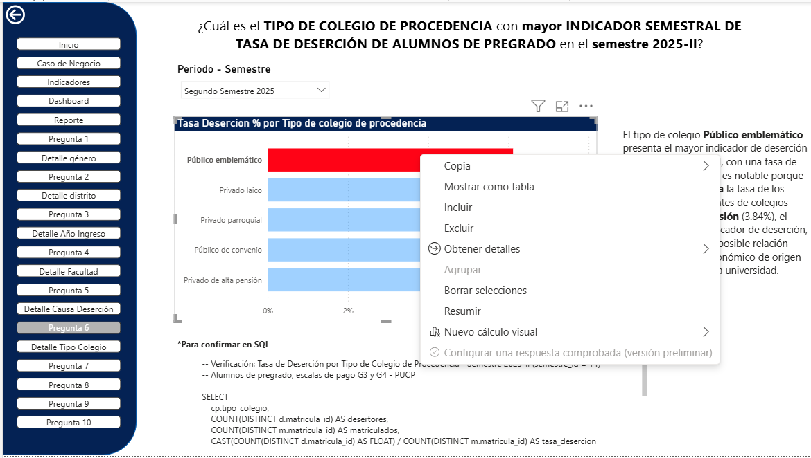

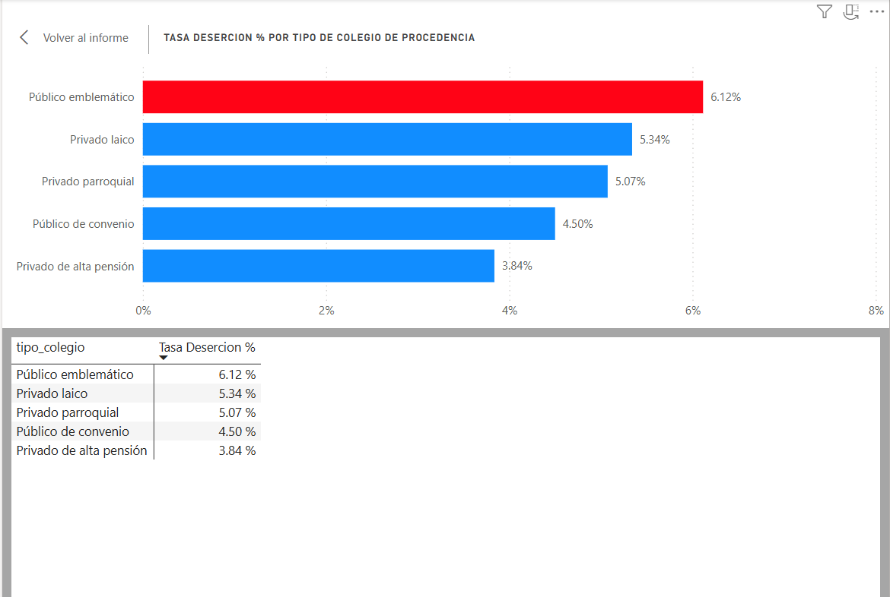

**Análisis**

El tipo de colegio Público emblemático presenta el mayor indicador de 
deserción en el semestre 2025-II, con una tasa de 6.12%. Este resultado es 
notable porque prácticamente duplica la tasa de los estudiantes provenientes 
de colegios Privados de alta pensión (3.84%), el grupo con menor indicador de 
deserción, lo que evidencia una posible relación entre el nivel socioeconómico 
de origen y la permanencia en la universidad.

**Consulta SQL de verificación**
```sql
-- Verificación: Tasa de Deserción por Tipo de Colegio de Procedencia - Semestre 2025-II (semestre_id = 14)
-- Alumnos de pregrado, escalas de pago G3 y G4 - PUCP

SELECT 
    cp.tipo_colegio,
    COUNT(DISTINCT d.matricula_id) AS desertores,
    COUNT(DISTINCT m.matricula_id) AS matriculados,
    CAST(COUNT(DISTINCT d.matricula_id) AS FLOAT) / COUNT(DISTINCT m.matricula_id) AS tasa_desercion
FROM G1.MATRICULA m
INNER JOIN G1.ALUMNO al 
    ON m.alumno_id = al.alumno_id
INNER JOIN G1.COLEGO_PROCEDENCIA cp 
    ON al.colegio_id = cp.colegio_id
LEFT JOIN G1.DESERCION d 
    ON d.matricula_id = m.matricula_id
WHERE m.semestre_id = 14  -- Segundo Semestre 2025 (2025-2)
GROUP BY cp.tipo_colegio
ORDER BY tasa_desercion DESC;
```

### Pregunta 7 - Tasa de Deserción por Tipo de Beca Académica

**¿Cuál es la beca académica con mayor indicador semestral de tasa de 
deserción de alumnos de pregrado en el semestre 2025-II?**

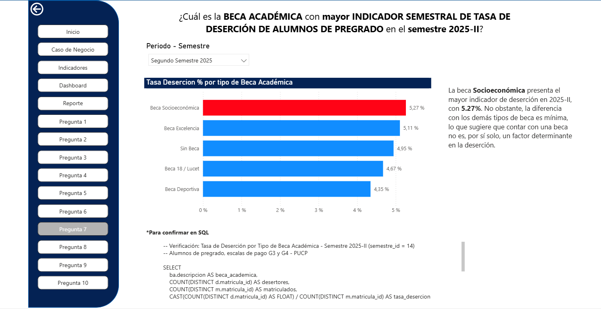

**Explorar detalle**
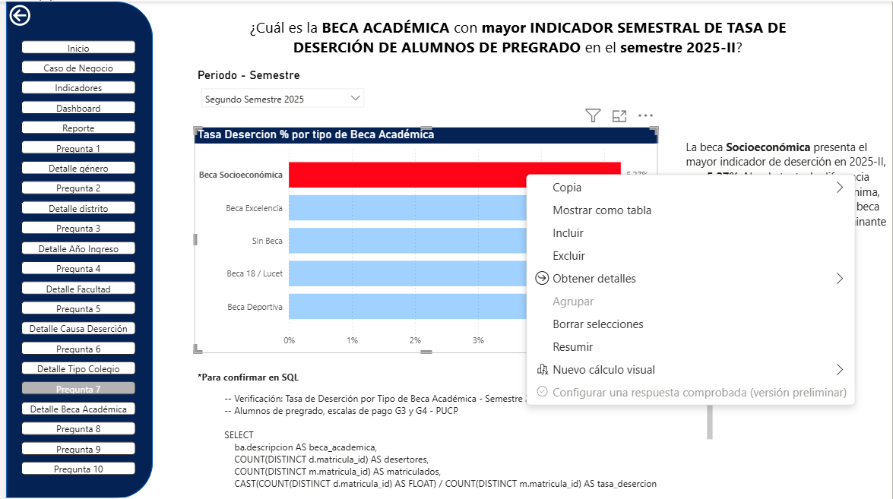

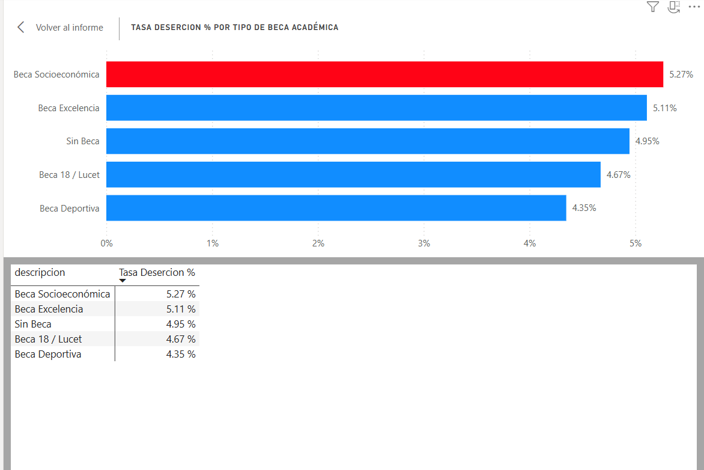

**Análisis**

La beca Socioeconómica presenta el mayor indicador de deserción en 2025-II, 
con 5.27%. No obstante, la diferencia con los demás tipos de beca es mínima, 
lo que sugiere que contar con una beca no es, por sí solo, un factor 
determinante en la deserción.

**Consulta SQL de verificación**
```sql
-- Verificación: Tasa de Deserción por Tipo de Beca Académica - Semestre 2025-II (semestre_id = 14)
-- Alumnos de pregrado, escalas de pago G3 y G4 - PUCP

SELECT 
    ba.descripcion AS beca_academica,
    COUNT(DISTINCT d.matricula_id) AS desertores,
    COUNT(DISTINCT m.matricula_id) AS matriculados,
    CAST(COUNT(DISTINCT d.matricula_id) AS FLOAT) / COUNT(DISTINCT m.matricula_id) AS tasa_desercion
FROM G1.MATRICULA m
INNER JOIN G1.BECA_ACADEMICA ba 
    ON m.beca_academica_id = ba.beca_academica_id
LEFT JOIN G1.DESERCION d 
    ON d.matricula_id = m.matricula_id
WHERE m.semestre_id = 14  -- Segundo Semestre 2025 (2025-2)
GROUP BY ba.descripcion
ORDER BY tasa_desercion DESC;
```

### Pregunta 8 - Tipo de Deserción con Mayor Indicador

**¿Cuál es el tipo de deserción con mayor indicador semestral de tasa de 
deserción de alumnos de pregrado en el semestre 2025-II?**

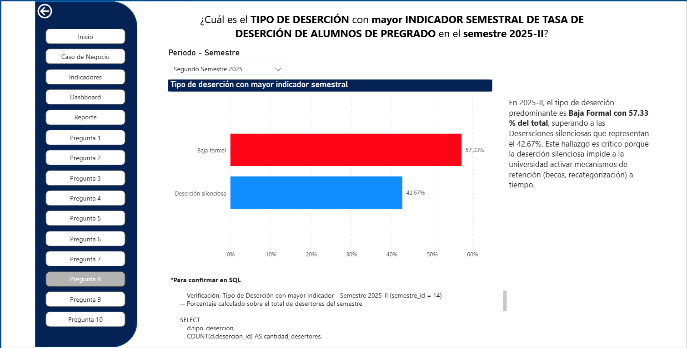

**Explorar detalle**
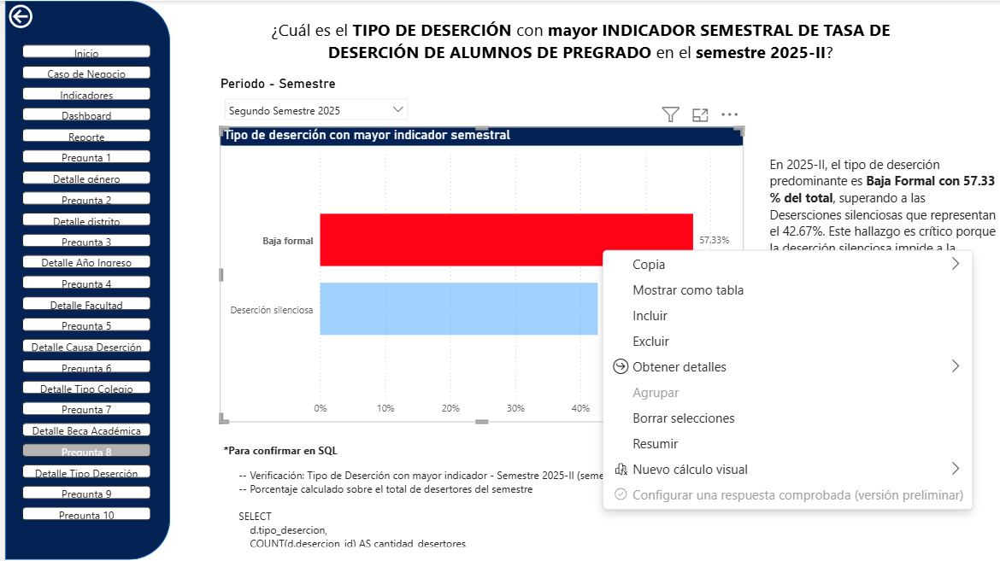

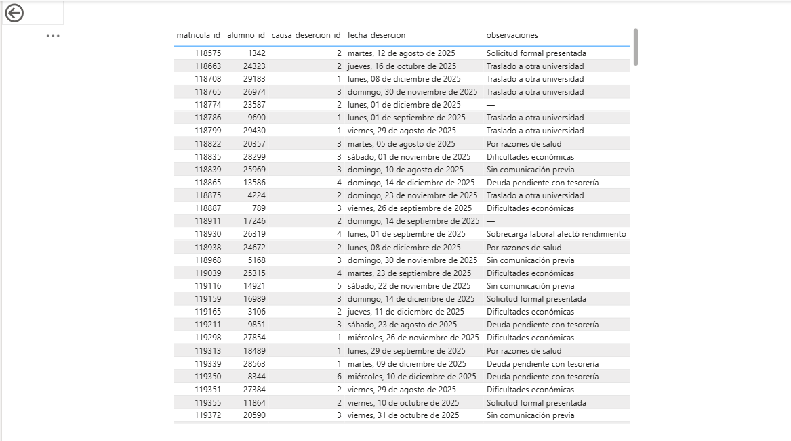

**Análisis**

En 2025-II, el tipo de deserción predominante es Baja Formal con 57.33% del 
total, superando a las Deserciones silenciosas que representan el 42.67%. 
Este hallazgo es crítico porque la deserción silenciosa impide a la 
universidad activar mecanismos de retención (becas, recategorización) a 
tiempo.

**Consulta SQL de verificación**
```sql
-- Verificación: Tipo de Deserción con mayor indicador - Semestre 2025-II (semestre_id = 14)
-- Porcentaje calculado sobre el total de desertores del semestre

SELECT 
    d.tipo_desercion,
    COUNT(d.desercion_id) AS cantidad_desertores,
    CAST(COUNT(d.desercion_id) AS FLOAT) / 
        SUM(COUNT(d.desercion_id)) OVER () AS porcentaje
FROM G1.DESERCION d
INNER JOIN G1.MATRICULA m 
    ON d.matricula_id = m.matricula_id
WHERE m.semestre_id = 14  -- Segundo Semestre 2025 (2025-2)
GROUP BY d.tipo_desercion
ORDER BY porcentaje DESC;
```

### Pregunta 9 - Semestre Académico con Mayor Tasa de Deserción

**¿Cuál es el semestre académico con mayor indicador semestral de tasa de 
deserción de alumnos de pregrado en los últimos 4 períodos?**

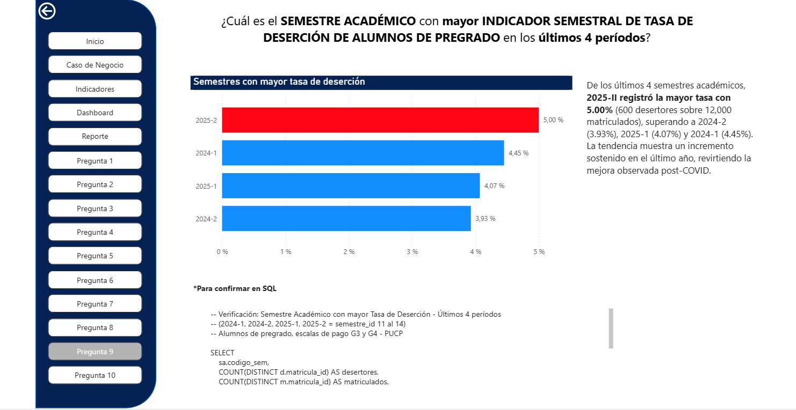

**Explorar detalle**
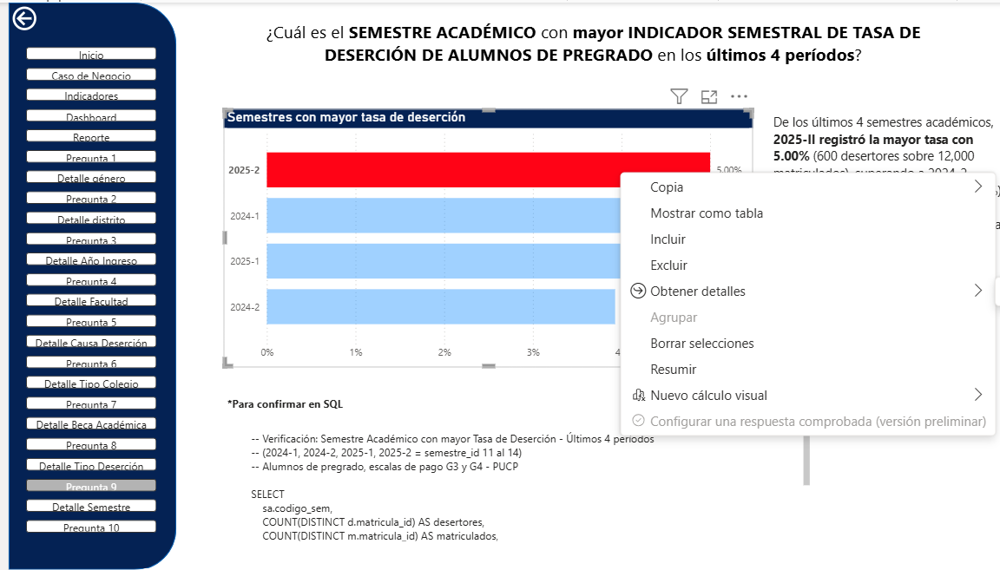

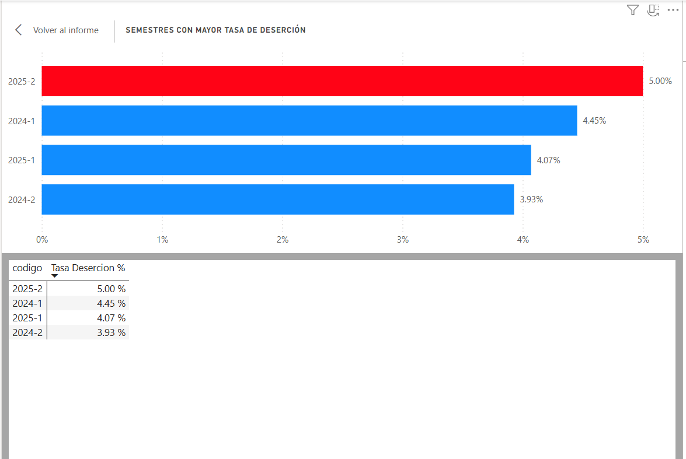

**Análisis**

De los últimos 4 semestres académicos, 2025-II registró la mayor tasa con 
5.00% (600 desertores sobre 12,000 matriculados), superando a 2024-2 (3.93%), 
2025-1 (4.07%) y 2024-1 (4.45%). La tendencia muestra un incremento sostenido 
en el último año, revirtiendo la mejora observada post-COVID.

**Consulta SQL de verificación**
```sql
-- Verificación: Semestre Académico con mayor Tasa de Deserción - Últimos 4 períodos
-- (2024-1, 2024-2, 2025-1, 2025-2 = semestre_id 11 al 14)
-- Alumnos de pregrado, escalas de pago G3 y G4 - PUCP
SELECT 
    sa.codigo_sem,
    sa.descripcion,
    COUNT(DISTINCT d.matricula_id) AS desertores,
    COUNT(DISTINCT m.matricula_id) AS matriculados,
    CAST(COUNT(DISTINCT d.matricula_id) AS FLOAT) / COUNT(DISTINCT m.matricula_id) AS tasa_desercion
FROM G1.MATRICULA m
INNER JOIN G1.SEMESTRE_ACADEMICO sa 
    ON m.semestre_id = sa.semestre_id
LEFT JOIN G1.DESERCION d 
    ON d.matricula_id = m.matricula_id
WHERE m.semestre_id BETWEEN 11 AND 14  -- Últimos 4 semestres: 2024-1, 2024-2, 2025-1, 2025-2
GROUP BY sa.codigo_sem, sa.descripcion
ORDER BY tasa_desercion DESC;
```

### Pregunta 10 - Tasa de Deserción por Modalidad de Ingreso

**¿Cuál es la modalidad de ingreso con mayor indicador semestral de tasa de 
deserción de alumnos de pregrado en el semestre 2025-II?**

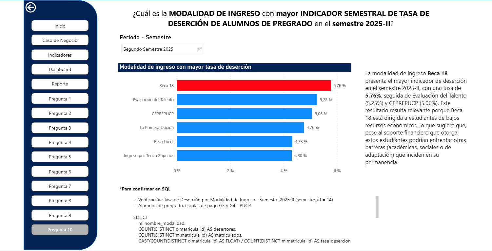

**Explorar detalle**
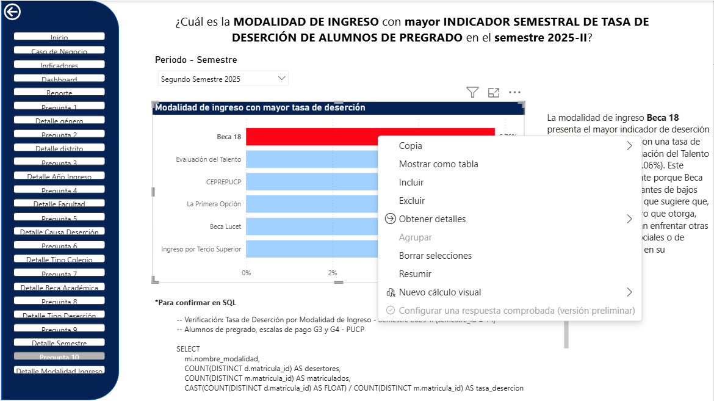

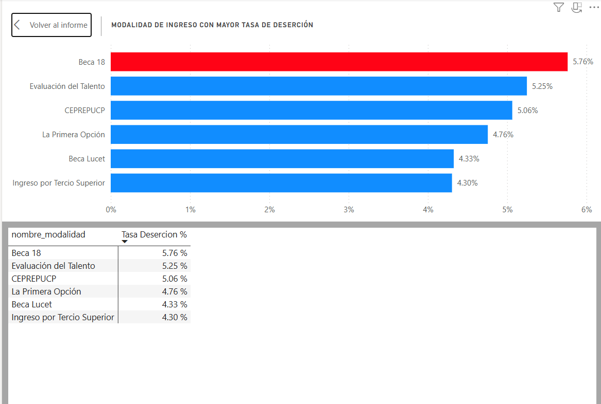

**Análisis**

La modalidad de ingreso Beca 18 presenta el mayor indicador de deserción en 
el semestre 2025-II, con una tasa de 5.76%, seguida de Evaluación del Talento 
(5.25%) y CEPREPUCP (5.06%). Este resultado resulta relevante porque Beca 18 
está dirigida a estudiantes de bajos recursos económicos, lo que sugiere que, 
pese al soporte financiero que otorga, estos estudiantes podrían enfrentar 
otras barreras (académicas, sociales o de adaptación) que inciden en su 
permanencia.

**Consulta SQL de verificación**
```sql
-- Verificación: Tasa de Deserción por Modalidad de Ingreso - Semestre 2025-II (semestre_id = 14)
-- Alumnos de pregrado, escalas de pago G3 y G4 - PUCP

SELECT 
    mi.nombre_modalidad,
    COUNT(DISTINCT d.matricula_id) AS desertores,
    COUNT(DISTINCT m.matricula_id) AS matriculados,
    CAST(COUNT(DISTINCT d.matricula_id) AS FLOAT) / COUNT(DISTINCT m.matricula_id) AS tasa_desercion
FROM G1.MATRICULA m
INNER JOIN G1.ALUMNO al 
    ON m.alumno_id = al.alumno_id
INNER JOIN G1.MODALIDAD_INGRESO mi 
    ON al.modalidad_ingreso_id = mi.modalidad_ingreso_id
LEFT JOIN G1.DESERCION d 
    ON d.matricula_id = m.matricula_id
WHERE m.semestre_id = 14  -- Segundo Semestre 2025 (2025-2)
GROUP BY mi.nombre_modalidad
ORDER BY tasa_desercion DESC;
```
